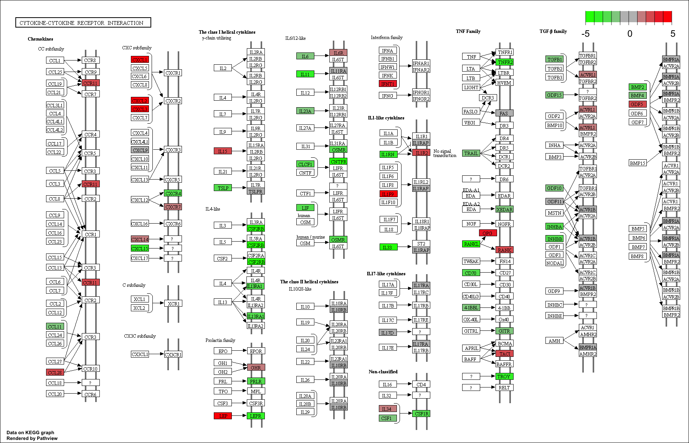

```{r setup, include=FALSE}
library(fgsea)
library(clusterProfiler)
library(pathview)
library(org.Mm.eg.db)
library(tidyverse)
knitr::opts_knit$set(cache=TRUE)
```

```{r prepareORAData, include=FALSE}
load("../Robjects/Annotated_Results_LvV.RData")
# Kegg data
sigGenes <- shrinkLvV$Entrez[ shrinkLvV$FDR < 0.01 & 
                              !is.na(shrinkLvV$FDR) &
                              abs(shrinkLvV$logFC) > 1 ]
sigGenes <- na.exclude(sigGenes)
kk <- enrichKEGG(gene = sigGenes, organism = 'mmu')
```

## Challenge 1

> 1. Use `pathview` to export a figure for "mmu04060", but this time only
> use genes that are statistically significant at FDR < 0.01

```{r solution1}
logFC <- shrinkLvV %>% 
  drop_na(FDR, Entrez) %>% 
  filter(FDR < 0.01) %>% 
  select(Entrez, logFC) %>% 
  deframe()

pathview(gene.data = logFC, 
         pathway.id = "mmu04060", 
         species = "mmu", 
         limit = list(gene=5, cpd=1))
```

mmu04060.pathview.png:



## Challenge 2 - GO term enrichment analysis

> `clusterProfiler` can also perform over-representation analysis on GO terms.
> using the commmand `enrichGO`. Look at the help page for the command 
> `enrichGO` (`?enrichGO`) and have a look at the instructions in the 
> [clusterProfiler book](http://yulab-smu.top/clusterProfiler-book/chapter5.html#go-over-representation-test).
>
> 1. Run the over-representation analysis for GO terms 
>     - Use genes that have an adjusted p-value (FDR) of less than 0.01 and
> an absolute fold change greater than 2.    
>     - For this analysis you can use Ensembl IDs rather then Entrez
>     - You'll need to provide the background (`universe`) genes, this should be
> all the genes in our analysis.
>     - The mouse database package is called `org.Mm.eg.db`. You'll need to load
>  it using `library` before running the analysis.    
>     - As we are using Ensembl IDs, you'll need to set the `keyType` 
> parameter in the `enrichGO` command to indicate this.
>     - Only test terms in the "Molecular Function" ontology 
> 2. Use the `dotplot` function to visualise the results.

```{r solution2}
library(org.Mm.eg.db)
sigGenes <- shrinkLvV %>% 
    drop_na(FDR) %>% 
    filter(FDR < 0.01 & abs(logFC) > 1) %>% 
    pull(GeneID)

universe <- shrinkLvV$GeneID

ego <- enrichGO(gene          = sigGenes, 
                universe      = universe,
                OrgDb         = org.Mm.eg.db,
                keyType       = "ENSEMBL",
                ont           = "MF",
                pvalueCutoff  = 0.01,
                readable      = TRUE)
dotplot(ego)
```

## Challenge 3

> Another common way to rank the genes is to order by pvalue, but also, sorting
> so that upregulated genes are at start and downregulated at the other - 
> you can do this combining the sign of the fold change and the pvalue. 
> 
> 1. Rank the genes by statisical significance - you will need to create
> a new ranking value using `-log10({p value}) * sign({Fold Change})`  
> 2. Load the "C2" pathways from the the `Robjects/mouse_c2_v5.RData` file   
> 3. Run `fgsea` using the new ranked genes and the C2 pathways  


```{r prepareGSEAData, include=FALSE}
# fgsea data
gseaDat <- filter(shrinkLvV, !is.na(Entrez))
ranks <- gseaDat$logFC
load("../Robjects/mouse_H_v5.RData")
pathwaysH <- Mm.H
```

```{r solution3b, eval=FALSE}
ranks <- -log10(gseaDat$pvalue) * sign(gseaDat$logFC) # or gseaDat$stat
names(ranks) <- gseaDat$Entrez  

load("Robjects/mouse_c2_v5.RData")

fgseaResC2 <- fgsea(Mm.c2, ranks, minSize=15, maxSize = 500)
head(fgseaResC2[order(padj, -abs(NES)), ], n=10)
```

```{r solution3, echo=FALSE}
ranks <- -log10(gseaDat$pvalue) * sign(gseaDat$logFC) # or gseaDat$stat
names(ranks) <- gseaDat$Entrez  

load("../Robjects/mouse_c2_v5.RData")

fgseaResC2 <- fgsea(Mm.c2, ranks, minSize=15, maxSize = 500)
head(fgseaResC2[order(padj, -abs(NES)), ], n=10) %>% tibble()
```

> 4. Run `fgsea` using the new ranked genes and the H pathways. How do these 
> results differ from the ones we got when ranking by the fold change alone? 

```{r solution3.4b, eval=FALSE}
fgseaResH <- fgsea(Mm.H, ranks, minSize=15, maxSize = 500)
head(fgseaResH[order(padj, -abs(NES)), ], n=20)
```

```{r solution3.4, echo=FALSE}
fgseaResH <- fgsea(Mm.H, ranks, minSize=15, maxSize = 500)
head(fgseaResH[order(padj, -abs(NES)), ], n=20) %>% tibble()
```


