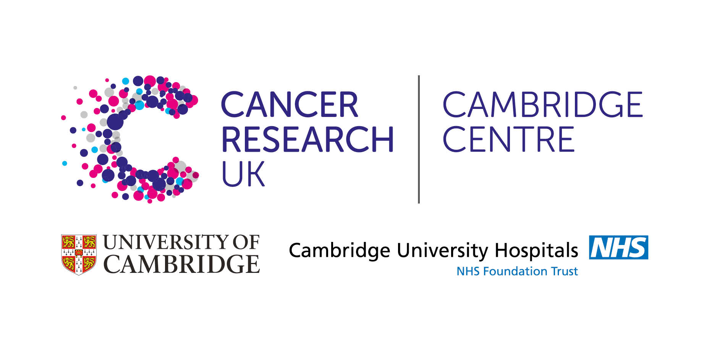

# Introduction to RNA-seq data analysis - Extended Materials
### 18th - 20th November 2020
#### Taught remotely
#### Bioinformatics Training, Craik-Marshall Building, Downing Site, University of Cambridge

These files contain some additional information and exercises not included 
during the taught course.

1. Obtaining public data
    - [Downloading files from SRA and aligning](Supplementary_Materials/S1_Getting_raw_reads_from_SRA.html)

2. Raw read file format and QC
    - [Using Trimmomatic to remove adapter contamination from reads](extended_html/Trimming.html)

3. Pre-processing - extended 
    - [A brief intro to the tidyverse](extended_html/02a_A_brief_intro_to_dplyr.html)  
    - A more extended tidyverse course can be found here: 
        [Introduction to R](https://bioinformatics-core-shared-training.github.io/r-intro/)

4. Annotation and Visualisation - extended 
    - [Annotation with biomaRt](extended_html/Annotation_With_BioMart.html)  
        - [practical solutions](extended_html/Annotation_With_BioMart.Solutions.html)
    - [Additional annotation and plotting](Supplementary_Materials/S3_Annotation_and_Visualisation.html)

5. Gene set testing - extended
    - [Gene-set testing](extended_html/06_Gene_set_testing.html)
    - [practical solutions](extended_html/06_Gene_set_testing.Solutions.html)

## Source Materials for Practicals

The all of the lecture slides and other source materials, including R code and 
practical solutions, can be found in the course's [Github 
repository](https://github.com/bioinformatics-core-shared-training/RNAseq_November_2020_remote)

### Supplementary lessons

Introductory R materials:

- [Introduction to R](https://bioinformatics-core-shared-training.github.io/r-intro/)

Additional RNAseq materials:

Data: Example Mouse mammary data (fastq files): 
	[https://figshare.com/s/f5d63d8c265a05618137](https://figshare.com/s/f5d63d8c265a05618137)]

### Additional resources - Places to get help

[Bioconductor help](https://www.bioconductor.org/help/)  
[Biostars](https://www.biostars.org/)  
[SEQanswers](http://seqanswers.com/)  

## Acknowledgements

This course is based on the course [RNAseq analysis in R](http://combine-australia.github.io/2016-05-11-RNAseq/) prepared by [Combine Australia](https://combine.org.au/) and delivered on May 11/12th 2016 in Carlton. We are extremely grateful to the authors for making their materials available; Maria Doyle, Belinda Phipson, Matt Ritchie, Anna Trigos, Harriet Dashnow, Charity Law.

